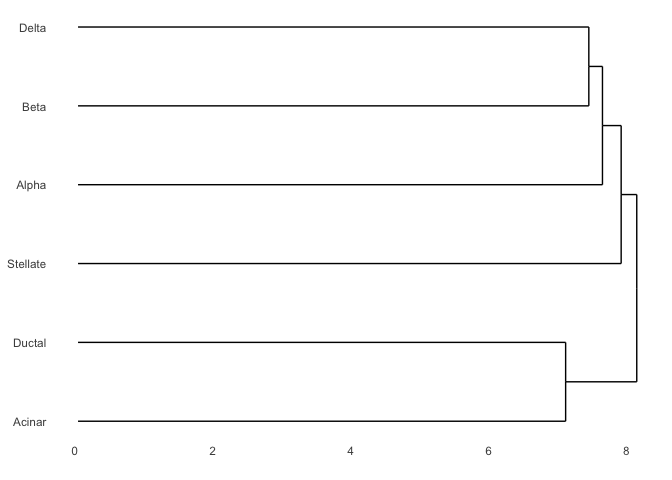
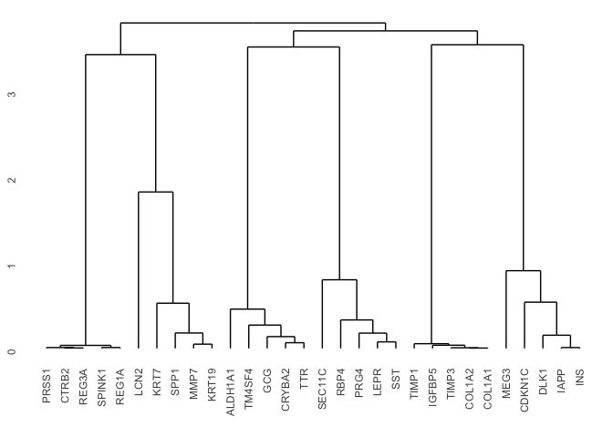
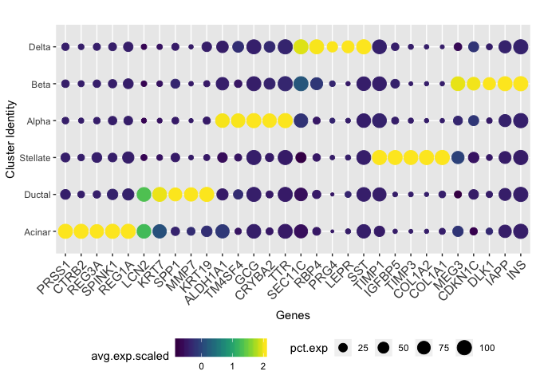
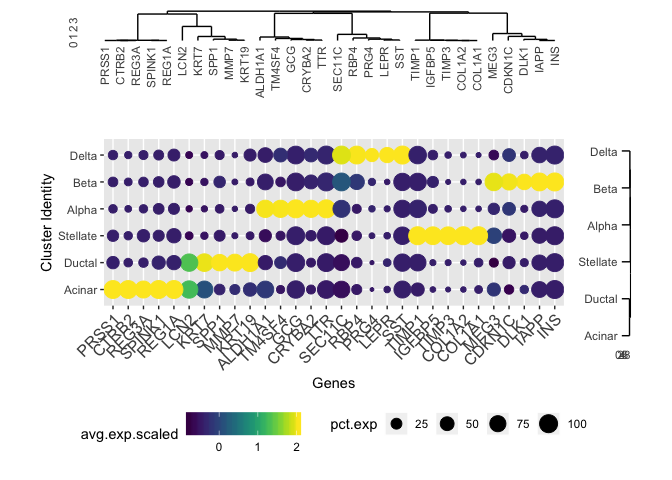
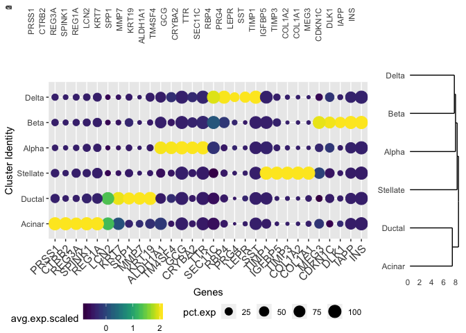

Visualization of scRNA-seq data with a dot-heatmap
================
Nathan Lawlor
3/13/2020

This is a vignette for visualizing single cell RNA-seq data in a dot plot format with additional dendrograms added to show the ordering/clustering of cells and features. The figure produced is similar to a heatmap, but it uses a dot plot instead to show the average expression levels of features and also the proportion of cells that express each feature.

Load libraries and data
-----------------------

``` r
suppressPackageStartupMessages(library(ggplot2))
suppressPackageStartupMessages(library(ggdendro))
suppressPackageStartupMessages(library(viridis))
suppressPackageStartupMessages(library(grid))
suppressPackageStartupMessages(library(reshape2))
suppressPackageStartupMessages(library(cowplot))
suppressPackageStartupMessages(library(dplyr))
suppressPackageStartupMessages(library(tidyr))
suppressPackageStartupMessages(library(egg))

# load in test data
df <- readRDS("Test.scRNAseq.data.for.dotplot.Rds")
df <- df[, c("features.plot", "id", "avg.exp.scaled", "pct.exp")]
head(df)
```

    ##        features.plot   id avg.exp.scaled    pct.exp
    ## INS              INS Beta      2.0406842 100.000000
    ## IAPP            IAPP Beta      2.0406947  97.555853
    ## DLK1            DLK1 Beta      2.0375557  67.755076
    ## CDKN1C        CDKN1C Beta      2.0002448  76.137738
    ## MEG3            MEG3 Beta      1.9632497  93.221310
    ## KRT19          KRT19 Beta     -0.4620293   8.923684

``` r
# data frame of genes, cell type identity, avg exp for each cell type, and % of cells expressing the gene
```

Clustering and creating ggdendrograms
-------------------------------------

``` r
# transform data frame from long to wide format and cluster for dendrograms
exp_df <- df[,c("features.plot", "id", "avg.exp.scaled")]
exp_mat <- tidyr::spread(exp_df, key = id, avg.exp.scaled)
# change rownames of dataframe to features, and remove the extra column
rownames(exp_mat) <- exp_mat$features.plot
exp_mat[,1] <- NULL
# examine format of the wide format data frame
exp_mat[1:4, 1:4]
```

    ##             Alpha       Beta      Delta   Acinar
    ## CTRB2  -0.4096107 -0.4098080 -0.4091783 2.041236
    ## SPINK1 -0.4116589 -0.4185189 -0.4162206 2.040979
    ## PRSS1  -0.4112045 -0.4115525 -0.4102488 2.041219
    ## REG3A  -0.4092041 -0.4094915 -0.4084747 2.041240

``` r
# clustering of cells (columns of data frame)
dendro <- as.dendrogram(hclust(d = dist(t(x = exp_mat))))
dendro.plot <- ggdendrogram(data = dendro, rotate = TRUE)
dendro.plot.no.labs <- ggdendrogram(data = dendro, rotate = TRUE, labels = F)
plot(dendro.plot)
```



``` r
# clustering of features (rows of data frame)
gene.dendro <- as.dendrogram(hclust(d = dist(x = exp_mat)))
gene.dendro.plot <- ggdendrogram(data = gene.dendro, rotate = FALSE)
gene.dendro.plot.nolabs <- ggdendrogram(data = gene.dendro, rotate = FALSE, labels = F)
plot(gene.dendro.plot)
```



``` r
cluster_labs <- labels(dendro)
gene_labs <- labels(gene.dendro)
# re-order levels in initial data frame to be used for the dotplot later on
df$features.plot <- factor(df$features.plot,levels=gene_labs)
df$id <- factor(df$id,levels=cluster_labs)
```

Dotplot of features and cells
-----------------------------

``` r
# create a dot plot of the avg scaled expression of each feature per cell type; size of dots reflect % of feature detection in a cell
gp_genes <- ggplot(df, aes(x = features.plot, y = id)) + 
  geom_point(data = df, aes(size = pct.exp, color = avg.exp.scaled)) +
  theme(axis.text.x = element_text(angle = 45, hjust = 1, size = 12)) + 
  scale_color_viridis() +
  labs(x = "Genes", y = "Cluster Identity", title = "") + 
  scale_fill_continuous(guide = guide_legend()) +
  theme(legend.position="bottom")
gp_genes
```



``` r
# also create a ggplot without the legends (to be used later when combining the dendrograms and dotplot images together)
gp_genes_no_legend <- ggplot(df, aes(x = features.plot, y = id)) + 
  geom_point(data = df, aes(size = pct.exp, color = avg.exp.scaled)) +
  theme(axis.text.x = element_text(angle = 45, hjust = 1, size = 12)) + 
  scale_color_viridis() +
  labs(x = "Genes", y = "Cluster Identity", title = "") + 
  scale_fill_continuous(guide = guide_legend()) +
  theme(legend.position = "none")
```

Visualization of dotplot and dendrograms (manual trial and error needed)
------------------------------------------------------------------------

``` r
# visualize using manual adjustment for coordinates (must change the x/y, width/height parameters in the viewport argument)
grid.newpage()
print(gp_genes, vp = viewport(x = 0.45, y = 0.4, width = 0.8, height = 0.75))
print(dendro.plot, vp = viewport(x = 0.90, y = 0.46, width = 0.1, height = 0.52))
print(gene.dendro.plot, vp = viewport(x = 0.48, y = 0.87, width = 0.78, height = 0.25))
```



Visualization of dotplot and dendrograms (no manual adjustment, but plots are not perfectly aligned)
----------------------------------------------------------------------------------------------------

``` r
# visualize roughly using grid/Grob objects (note that the alignment of plots won't be perfect)
gA <- ggplotGrob(gp_genes_no_legend)
gB <- ggplotGrob(gene.dendro.plot)
gC <- ggplotGrob(dendro.plot)
# empty plot to be used for blank space in final image
gD <- ggplotGrob(ggplot(mtcars, aes(x = wt, y = mpg)) + theme_void())

# get legend of feature dotplot
legend <- cowplot::get_legend(gp_genes)

# plot the dotplot and ggdendrograms together 
grid.arrange(
  grobs = list(gB, gD, gA, gC, legend, gD),
  widths = c(4, 1),
  heights = c(0.5, 2, 0.25),
  layout_matrix = rbind(c(1, 2),
                        c(3, 4),
                        c(5, 6)),
  nrow = 3
)
```



Session Information
-------------------

``` r
sessionInfo()
```

    ## R version 3.6.2 (2019-12-12)
    ## Platform: x86_64-apple-darwin15.6.0 (64-bit)
    ## Running under: macOS Catalina 10.15.2
    ## 
    ## Matrix products: default
    ## BLAS:   /System/Library/Frameworks/Accelerate.framework/Versions/A/Frameworks/vecLib.framework/Versions/A/libBLAS.dylib
    ## LAPACK: /Library/Frameworks/R.framework/Versions/3.6/Resources/lib/libRlapack.dylib
    ## 
    ## locale:
    ## [1] en_US.UTF-8/en_US.UTF-8/en_US.UTF-8/C/en_US.UTF-8/en_US.UTF-8
    ## 
    ## attached base packages:
    ## [1] grid      stats     graphics  grDevices utils     datasets  methods   base     
    ## 
    ## other attached packages:
    ##  [1] egg_0.4.5         gridExtra_2.3     tidyr_1.0.2       dplyr_0.8.4       cowplot_1.0.0     reshape2_1.4.3    viridis_0.5.1    
    ##  [8] viridisLite_0.3.0 ggdendro_0.1-20   ggplot2_3.2.1    
    ## 
    ## loaded via a namespace (and not attached):
    ##  [1] Rcpp_1.0.3       pillar_1.4.3     compiler_3.6.2   plyr_1.8.5       tools_3.6.2      digest_0.6.25    evaluate_0.14    lifecycle_0.1.0 
    ##  [9] tibble_2.1.3     gtable_0.3.0     pkgconfig_2.0.3  rlang_0.4.4      rstudioapi_0.11  yaml_2.2.1       xfun_0.12        withr_2.1.2     
    ## [17] stringr_1.4.0    knitr_1.28       vctrs_0.2.3      tidyselect_1.0.0 glue_1.3.1       R6_2.4.1         rmarkdown_2.1    farver_2.0.3    
    ## [25] purrr_0.3.3      magrittr_1.5     scales_1.1.0     htmltools_0.4.0  MASS_7.3-51.5    rsconnect_0.8.16 assertthat_0.2.1 colorspace_1.4-1
    ## [33] labeling_0.3     stringi_1.4.6    lazyeval_0.2.2   munsell_0.5.0    crayon_1.3.4
